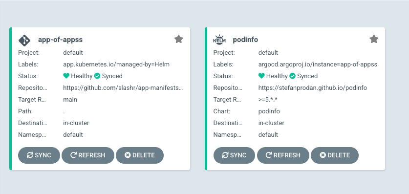

# From Git to Ops

1. Spin up a K8S cluster using Terraform
2. [Setup ArgoCD](#setup-argocd)
3. [Get Used to (and understand) SemVer](#understand-semver)
4. Setup Chart Museum
5. Create a MonoRepo
6. Create a Common Helm Template directory
7. Automate your Deployments!

---
<h2 id="setup-argocd"> Setup ArgoCD </h2>
An important building block of GitOps is how we handle releases and deployments. The recommended way it to have a repository which describes the *state* of a deployment. This state is a declarative way of saying which app do you want to be deployed, which version of the app, which configuration and so on. 

ArgoCD and Flux both offer these state based deployment models with the exception that ArgoCD offers a UI (very useful in my opinion). 

ArgoCD offers a Helm chart so let's quickly install it on our cluster

```bash   
helm repo add argo https://argoproj.github.io/argo-helm
helm install argo-cd argo/argo-cd -n argo-cd --create-namespace --values=values.yaml
```
A basic values.yaml file for the ArgoCD installation is inside the argocd directory on the repo

Now with ArgoCD up and running, we can deploy our very first app. To keep things simple, let's use the wonderfully simple [podinfo](https://github.com/stefanprodan/podinfo) app. 

In order to install this using ArgoCD, we first need to add the Helm repo URL of the app in ArgoCD. 

Inside argocd/values.yaml add the following block  
```yaml
configs:
  repositories:
    podinfo-helm-repo:
      url: https://stefanprodan.github.io/podinfo
      name: podinfo
      type: helm
```

and then run `helm upgrade argo-cd argo/argo-cd -n argo-cd --create-namespace --values=values.yaml`

We also need to setup a new repository on Github which will serve as the [App manifests](https://argo-cd.readthedocs.io/en/latest/user-guide/commands/argocd_app_manifests/) source. It's a good practice to have a separate repo for your app manifests in order to distinguish purpose and also to keep the codebase clean. 

After creating this new repo, we need to add it to ArgoCD just like we did for the Helm repo. 
So under config.repositories, add another block for your Git app-manifests repo
```yaml
app-manifests-repo:
  url: https://github.com/slashr/app-manifests.git
  name: app-manifests
  type: git
```

You should now see the Helm and Git repositories successfully added in ArgoCD Settings - Repositories page!

<center></center>


### Creating a new Deployment using ArgoCD 

We'll now create what ArgoCD calls an "app-of-apps" to deploy Podinfo on our cluster. Add the following code to create an app-of-apps using ArgoCD. 
```yaml
server:
  autoscaling:
    enabled: true
    minReplicas: 2
  additionalApplications:
    - destination:
        namespace: "default"
        server: "https://kubernetes.default.svc"
      finalizers:
        - "resources-finalizer.argocd.argoproj.io"
      name: "app-of-apps"
      namespace: "argo-cd"
      project: "default"
      source:
        directory:
          recurse: true
        path: "."
        repoURL: "https://github.com/slashr/app-manifests.git"
        targetRevision: "main" #should correspond to the active branch name
```    
Be careful to indent the block properly as not doing so can lead to hard to debug errors. Sometimes the code is perfectly correct but because the YAML is missing a space or has an extra one, it's not parsed correctly and you wouldn't know what's wrong easily. 

Now our values.yaml for ArgoCD is good enough for having ArgoCD up and running with the required repositories configured inside it. Now we'll create a App manifest for Podinfo inside our app-manifests repo. 

Create a directory podinfo inside the repo and then create a file release.yaml with the following code
```yaml
apiVersion: argoproj.io/v1alpha1
kind: Application
metadata:
  name: podinfo
  namespace: argo-cd
  finalizers:
  - resources-finalizer.argocd.argoproj.io
spec:
  destination:
    namespace: default
    server: 'https://kubernetes.default.svc'
  syncPolicy:
    automated:
      selfHeal: true
    syncOptions:
    - CreateNamespace=true
  project: default
  source:
    targetRevision: '>=6.*.*'
    repoURL: 'https://stefanprodan.github.io/podinfo'
    chart: podinfo
    helm:
      values: |
        replicaCount: '2'
 ```

Since ArgoCD doesn't support external values.yaml file for Helm charts yet, you can use the `values: |` parameter of Argo release.yaml to specify the values.yaml as a string inside the release.yaml file. 
The rest of the code is pretty self-explanatory except for the targetRevision. Helm charts use Semver versioning and it's important to understand it in order to see how the Regex inside the targetRevision field is being used. 

Now after a `terraform apply`, you will be able to see the app-of-apps on the ArgoCD homepage along with the podinfo app. Success! We have deployed our first app using through ArgoCD. 

<center></center>


---

<h2 id="understand-semver"> Get Used to (and understand) SemVer</h2>

Semver is a way of systematically managing your app versions. It basically consists of 4 fields out of which 3 are non-optional. For example, 1.4.0-beta is a valid semver where 
- 1 - Major Version representing breaking API changes
	  
- 4 - Minor Version representing backwards compatible changes
	  
- 0 - Patch Versions representing bugfixes 
	  
- beta - Pre-release tag used to usually deploy and test on non-production environments

	 
   In the hidden documentations of Semver, you will find how to use pre-release tags in your automated deployments. 
   [Here](https://github.com/Masterminds/semver#working-with-prerelease-versions) you will see that in order to deploy a pre-release tag, you will have to use the expression

	 `>=1.3.0-0` 

	  
   The result of this expression would be something like 1.3.1-beta
	 Note that the pre-release tag follows the ASCII table for order of precedence which means 1.3.1-ALPHA < 1.3.1-alpha. This is because `a` has higher precedence in the ASCII table than `A`. So to keep it simple, always use lower-case letters for the pre-release tag and also try to keep it as simple as possible.

---

## Spin up a K8S cluster using Terraform
To an extent, it is Kubernetes that largely enables the possiblity of having infrastructure as code. Paired with Terraform, the need for clicking buttons and navigating through GUIs becomes less and less necessary. 

The easisest solution to setup a homelab would be to use Minikube. Install minikube and set up a 2 node cluster on your machine. 

We can then use Terraform to make changes to this cluster. So make a `terraform` directory in your gitops repo and then create a `provider.tf` file 
```hcl
provider "kubernetes" {
config_path            = "~/.kube/config"
config_context_cluster = "minikube"
}
```

Perfect, that should give Terraform access to our Minikube cluster. Now remember, how we manually had to do the argo-cd namespace and also do a "helm upgrade" for every update. Well, we can just use Terraform now to automate this.  

So, delete the namespace `argo-cd` we created manually using helm and let's do it with Terraform. Add a new file `cluster.tf` in the terraform directory and add these lines
```hcl
resource "kubernetes_namespace" "argo-cd" {
  metadata {
    name = "argo-cd"
  }
}
``` 
Run `terraform apply` to create this namespace that can be controlled using Terrafrom. After the namespace is created, we can move on to also installing the ArgoCD Helm chart, along with it's custom values.yaml using Terraform. We'll do this in a [modular](https://www.terraform.io/language/modules/develop) way as is Terraform best practice.

Create a directory `argo-cd` inside of a `modules` directory.

Try deleting and creating using Terraform. When it works a couple of times, you have achieved what is called a state of "reproduceability". This will help us out in the future when the infrastructure starts to become more and more complex yet we stick to the principle of having almost all config in the form of infra-as-code. Even with infra-as-code, there are certain parameters and flows that might not lead to perfect reproduceability of your setup, and that's where creating/recreating can also be a debugging process where you iron out the clinks in the armor. It's a surety, that the behaviour of your code, for it's given state, will be the same no matter what. 

---

## Write Helm Charts for your app!
There is really no better way to handle the deployment, versioning and management of Kuberentes objects than Helm charts. Sure, it is Yet Another Abstraction Layer, but I would claim it's a highly efficient one. 

---

## Automate your Deployments
With the above semver quirks in mind, you are now ready to setup an automatic CD pipeline that goes from dev -> stage -> production

You can have your builds tagged with a -dev pre-release tag for test releases. These can then be promoted to -beta staging releases after some testing. 

Finally, the -beta artifacts can be promoted to no pre-release production artificats. This can be achieved by having the CI pipeline perform a git commit on the MonoRepo to update the Chart version tag in the values.yaml of the application. 

---

## Further improvement: Seal your Secrets
The easiest and quickest way to have a Secret management system is to use Sealed Secrets. Secrets and credentials can become quite annoying when trying to codeify your infrastructure. There's often intermingling dependenices of apps on secrets and on each other that make it very difficult to have a smooth IaaC pipeline. 

Sealed Secrets addresses this by allowing you to have encrypted secret texts in your code. These Secrets can only be encrypted by a person who has the public/private keypair of the Sealed Secrets operator. So this keypair becomes sort of like a key to your vault of secrets. 

You can use Terraform to first install the Sealed Secrets operator with a custom keypair (so that you don't have reenrypt your passwords everytime), and then create a SealedSecret CRD with the encrypted Secrets. The SealedSecrets operator will then read this CRD and then unseal into a regular K8S Secret. 

---

### Notes
* Cert Manager has two types of Cluster Issuers - Staging and Prod
* Certs issued by the Staging server is not recognized by browsers and is as good as a self-signed certificate
* Certs issued by Prod server are recognized and have rate limits on the verification API. So use it only for Production purposes
* Terraform offers a time_sleep resource for creating a delay when waiting on resources like Ingress to populate a public IP
* Terraform data blocks are used to refer to a resource created outside of Terraform/or by a different Terraform template
* Nginx Ingress routes traffic automatically to all underlying Services. So we need just one public facing endpoint (the Nginx Load Balancer IP) to route traffic to all other services. It's basically a reverse proxy
