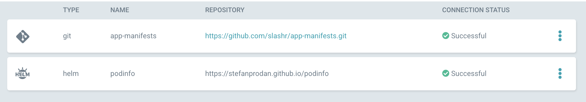
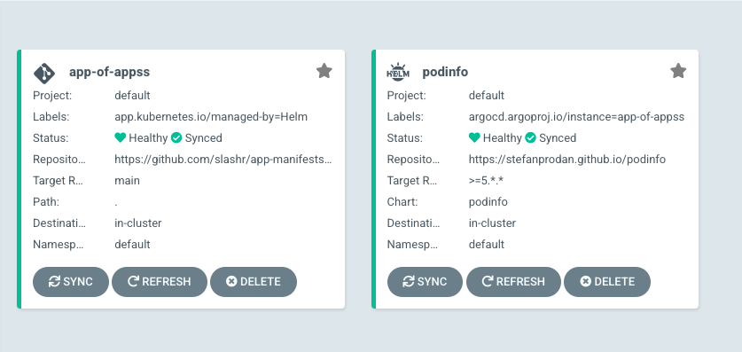

# GitOps in Reverse

This article is part of a series to have your Infrastructure deployed using the GitOps approach. We'll start by deploying a microservice on a Kubernetes cluster using a minimal Continuous Deployment framework and then keep adding and modifying our setup to make it complete and comprehensive. In this article, we'll look at how we can use ArgoCD to manage automatic deployments of apps. 

1. [Spin up a K8S cluster using Minikube](#create-cluster)
2. [Setup ArgoCD](#setup-argocd)
3. [Prepare Podinfo](#prepare-podinfo)
4. [Create ArgoCD app-of-apps](#create-app-of-apps)

---
<h2 id="create-cluster"> Spin up a K8s Cluster using Minikube </h2>

To an extent, it is Kubernetes that largely enables the possiblity of having infrastructure as code. Paired with Terraform, the need for clicking buttons and navigating through GUIs becomes less and less necessary. 

The easisest solution to setup a homelab would be to use Minikube. Install minikube and set up a two node cluster on your machine. 

We can then use Terraform to make changes to this cluster. So make a `terraform` directory in your gitops repo and then create a `provider.tf` file 
```hcl
provider "kubernetes" {
config_path            = "~/.kube/config"
config_context_cluster = "minikube"
}
```

Perfect, that should give Terraform access to our Minikube cluster. 


---
<h2 id="setup-argocd"> Setup ArgoCD </h2>

We can now start creating ArgoCD Terraform templates in a [modular](https://www.terraform.io/language/modules/develop) way as is Terraform best practice.

Create a directory `argo-cd` inside of a `modules` directory. Let's create a file argo-cd.tf with the following contents

```hcl
resource "kubernetes_namespace" "argo-cd" {
  metadata {
    name = "argo-cd"
  }
}

resource "helm_release" "argo-cd" {
  name       = "argo-cd"
  namespace  = "argo-cd"
  repository = "https://argoproj.github.io/argo-helm"
  chart      = "argo-cd"
  version    = "4.2.3"

  values = [templatefile("${path.module}/values.yaml",{})]

  depends_on = [
    resource.kubernetes_namespace.argo-cd
  ] 
}
```

We are first creating a namespace and then using the `helm_release` provider to install the argo-cd Helm chart along with a custom values.yaml file, the contents of which should be as follows:
```yaml
controller:
  enableStatefulSet: true

server:
  autoscaling:
    enabled: true
    minReplicas: 2

repoServer:
  autoscaling:
    enabled: true
    minReplicas: 2

configs:
  secret:
    argocdServerAdminPassword: $2a$10$6Oa1o/Y/5xjDk2dQCQ8F9uDCqm9w8BJEp7ZjI0.SvmZqIXXpHFyQW
```

The `argocdServerAdminPassword` is optional but makes it easy to access ArgoCD since otherwise you'll have to fetch the `initial admin secret` from the cluster everytime you recreate the deployment. It is a hashed value which can be generated using `htpasswd -nbBC 10 "" $ARGO_PWD | tr -d ':\n' | sed 's/$2y/$2a/'`


With this we are ready to install Argo-CD! Run `terraform apply` to install it.

Try deleting and creating using Terraform. When it works a couple of times, you have achieved what is called a state of "reproduceability". This will help us out in the future when the infrastructure starts to become more and more complex yet we stick to the principle of having almost all config in the form of infra-as-code. 

But even with infra-as-code, there are certain parameters and flows that might not lead to perfect reproduceability of your setup, and that's where creating/recreating can also be a debugging process where you iron out the clinks in the armor.  

An important building block of GitOps is how we handle releases and deployments. The recommended way is to specify in the form of code the *state* of a deployment. This state is a declarative way of saying which app do you want to be deployed, which version of the app, which configuration and so on. 

ArgoCD and Flux both offer these state based deployment models with the exception that ArgoCD offers a UI. 

<h2 id="prepare-podinfo"> Prepare Podinfo </h2>
Now with ArgoCD up and running, we can deploy our very first app. To keep things simple, let's use the wonderfully simple [podinfo](https://github.com/stefanprodan/podinfo) app. 

In order to install this using ArgoCD, we first need to add the Helm repo URL of the app in ArgoCD. 

Inside argocd/values.yaml add the following block  
```yaml
configs:
  repositories:
    podinfo-helm-repo:
      url: https://stefanprodan.github.io/podinfo
      name: podinfo
      type: helm
```

and then run `helm upgrade argo-cd argo/argo-cd -n argo-cd --create-namespace --values=values.yaml`

This means that ArgoCD now knows about the Podinfo Helm repo and will the Podinfo chart version defined by us. But where exactly do we define the version we want to deploy? Inside [App manifests](https://argo-cd.readthedocs.io/en/latest/user-guide/commands/argocd_app_manifests/)

One of the approaches to Gitops is to put our "declarative manifests" inside a repo independent of application code. So simply create a new Git repo and name it  or something similar. 

Inside this repo, create a directory `podinfo` with the file `release.yaml` consisting this code: 
```yaml

apiVersion: argoproj.io/v1alpha1
kind: Application
metadata:
  name: podinfo
  namespace: argo-cd
  finalizers:
  - resources-finalizer.argocd.argoproj.io
spec:
  destination:
    namespace: default
    server: 'https://kubernetes.default.svc'
  syncPolicy:
    automated:
      selfHeal: true
    syncOptions:
    - CreateNamespace=true
  project: default
  source:
    targetRevision: '>=5.*.*'
    repoURL: 'https://stefanprodan.github.io/podinfo'
    chart: podinfo
    helm:
      values: |
        replicaCount: '2'
```

This is the *state* we want our app to be in. 

Since ArgoCD doesn't support external values.yaml file for Helm charts yet, you can use the `values: |` parameter of Argo release.yaml to specify the values.yaml as a string inside the release.yaml file. 
The rest of the code is pretty self-explanatory except for the targetRevision. Helm charts use Semver versioning and it's important to understand it in order to see how the Regex inside the targetRevision field is being used. 


<h2 id="create-app-of-apps"> Create ArgoCD App-of-Apps </h2>

After creating this new repo, we need to add it to ArgoCD just like we did for the Helm repo. 
So under config.repositories, add another block for your Git app-manifests repo

```yaml
app-manifests-repo:
  url: https://github.com/slashr/app-manifests.git
  name: app-manifests
  type: git
```

You should now see the Helm and Git repositories successfully added in ArgoCD Settings - Repositories page!

<center></center>

Now, lets create what ArgoCD calls an "app-of-apps" to deploy Podinfo on our cluster. Add the following code to argo-cd.tf to create an *app-of-apps*. 

```yaml
server:
  autoscaling:
    enabled: true
    minReplicas: 2
  additionalApplications:
    - destination:
        namespace: "default"
        server: "https://kubernetes.default.svc"
      finalizers:
        - "resources-finalizer.argocd.argoproj.io"
      name: "app-of-apps"
      namespace: "argo-cd"
      project: "default"
      source:
        directory:
          recurse: true
        path: "."
        repoURL: "https://github.com/slashr/app-manifests.git"
        targetRevision: "main" #should correspond to the active branch name
```    
Be careful to indent the block properly as not doing so can lead to hard to debug errors. Sometimes the code is perfectly correct but because the YAML is missing a space or has an extra one, it's not parsed correctly and you wouldn't know what's wrong easily. 

Now our values.yaml for ArgoCD is good enough for having ArgoCD up and running with the required repositories configured inside it. 

Now after a `terraform apply`, you will be able to see the app-of-apps on the ArgoCD homepage along with the podinfo app. Success! We have deployed our first app using through ArgoCD. 

<center></center>


---


